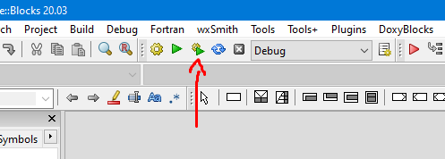
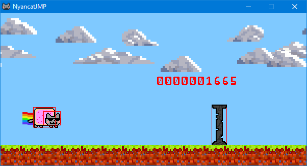

# NyanCatJMP

A game made for *INT2215*

[](./LICENSE)

- [NyanCatJMP](#nyancatjmp)
	- [Prerequisites](#prerequisites)
	- [Setting up IDE](#setting-up-ide)
	- [Compiling](#compiling)
	- [Screenshot](#screenshot)
	- [License](#license)

## Prerequisites

- I made this with Windows10 so a [Windows10](https://www.microsoft.com/en-us/software-download/windows10) ofc (idk if Windows7 would work)
- A [Codeblocks](http://www.codeblocks.org/downloads/26) version with MinGW
- [SDL2](https://www.libsdl.org/download-2.0.php) Development Library with MinGW
- [SDL_image](https://www.libsdl.org/projects/SDL_image/) Development Library with MinGW

## Setting up IDE

- Go to **Settings -> Compiler -> Global compiler settings -> Linker settings** and fill the **Other linker options** box with ```-lmingw32 -lSDL2main -lSDL2 -lSDL2_image```

- Go to **Settings -> Compiler -> Global compiler settings -> Search directories** and add:

	- `i686-w64-mingw32\include\SDL2`

	from the SDL2 and SDL_image library you've just downloaded to the **Compiler** tab.

- Go to **Settings -> Compiler -> Global compiler settings -> Search directories** and add:

	- `i686-w64-mingw32\include`
	- `i686-w64-mingw32\lib`

	from the SDL2 and SDL_image library you've just downloaded to the **Linker** tab.

## Compiling

- Just open Codeblocks and drag the `.cbp` file into Codeblocks.
- Finally press **Build and Run**.



## Screenshot



## License

This project is licensed under the [**MIT License**](https://choosealicense.com/licenses/mit).